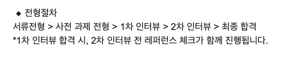
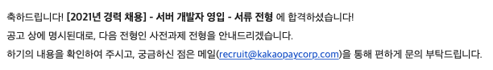
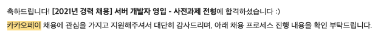
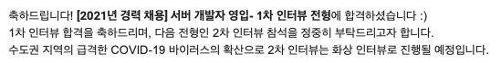
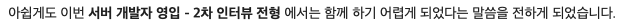
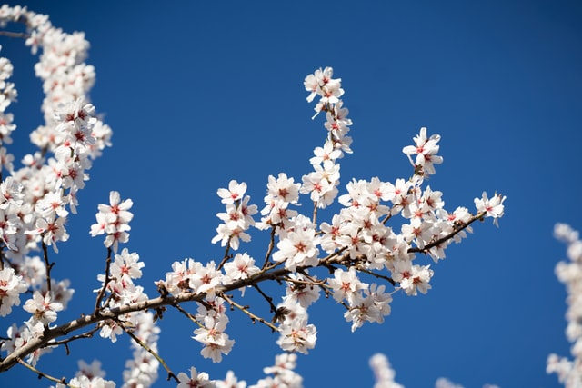

## 서론

작년 8월 귀국 이후, 마음껏 자유를 만끽했다. 그동안 퇴근 후 공부를 하느라 시간이 참 빠듯했지만, 이젠 그럴 이유가 전혀 없게 된 것이 가장 좋았다. 다만 놀면 시간이 총알 같다. 이제 봄이 오고 슬슬 취직을 걱정해야 되는 시기가 찾아왔다.

2월말 경, 카카오페이가 경력 채용 공고를 냈다. 이미 2020년에 한 번 지원해서 1차에서 떨어진 경험이 있었다. 이번엔 다르리라 결심하고 한 번 더 도전해보기로 했다. 그래서 지원 접수가 끝나기 전에 부랴부랴 준비해서 지원했다.

-----

## 1. 서류 전형

지원서는 사이트를 통해 정해진 폼에 맞춰 내 경력이나 학력을 적으면 된다. 포트폴리오는 어떻게 만들어야 될지 감이 안 와서 그동안에 했던 일을 정리해서 만든 파일을 제출했다. **다행히도 합격 메일이 왔다!**

## 2. 사전 과제 전형

사전 과제는 1주일이 주어진다. 카카오페이 측에서 Github에 리포지터리를 만들어주는데, 거기에 과제를 작성해서 올리는 방식이다. 이전에 사전 과제를 진행했을 땐 내 계정에 직접 리포지터리를 만들어서 제출했는데, 문제 유출로 인해 문제도 바꾸고 방식도 바꾼 듯 하였다.

사전 과제는 REST API 애플리케이션을 작성하는 것으로, JVM 기반 언어와 `Spring Framework`로 작성하면 된다. `Java`로 백엔드 애플리케이션을 많이 만들어본 경험이 있다면 충분히 만들 수 있지 않을까 하는 느낌이다.

주어진 1주일 동안 다른 회사에서 진행한 사전과제 일정이 겹쳐서 너무 바삐 작성해야 했다. 그래도 공부한 티가 나는지 이전에 지원했을 때보다 훨씬 애플리케이션을 잘 작성한 듯 하여 뿌듯하긴 했다.

뿌듯한 맘이 통했을까? **다행히 사전 과제 전형도 합격하였다!**

## 3. 1차 인터뷰

사전 과제까지야 내가 내 페이스대로 만들 수 있으니 괜찮을 수 있지만 면접은 차원이 다르다. 정말 느낌적인 느낌으로 내 몸이 이해하는 그 지식을 말로 표현한다는 것만큼 어려운 일이 또 있을까? 

면접관 3분과 진행하는 1차 면접 내용은 크게 **경력을 기반으로 하는 면접**과 **과제를 리뷰하는 면접**으로 나뉜다. 경력을 기반으로 하는 면접은 경력에서부터 점점 내용이 심화했다.

- 이직 사유
- 이전 회사에서 만든 애플리케이션의 구조
- 코드 리뷰는 어떻게 해왔나?
- 스프링에 대한 설명(특징, 스프링에서 사용하는 디자인 패턴 등)
- 기타 CS 지식

사전 과제는 코드를 같이 보며 진행했다. 내가 코드를 보며 왜 이렇게 만들었는지 설명을 해야 되는데 이게 참 어렵다. 어렵지만 내가 중점을 두고 만든 코드부터 얘기하며 진행했다.

다회차 1차 면접에서 실패한 경험을 보유했기에 그래도 대답을 이어나갈 수 있었다. 다만 정말 크게 실수한 부분이 **byte는 값의 범위가 어떻게 되는가**였다. 

이전 회사에서 있었던 일을 얘기하던 도중, "에러 코드를 `byte`에서 `short`으로 바꾸느라 고생하신 분이 있었다"는 얘기를 하다가 저런 질문을 받게 되었다. 이전에 다룬 애플리케이션은 C#으로 작성되었기에 `unsinged`가 존재했고 에러코드에 음수를 사용하지는 않았어서 자연스레 "0 ~ 255"를 얘기해버렸다. 

면접이 끝나고 정말 아차 싶었다. 떨어졌다고 생각했다. '기본적인 것도 모른다며 떨어뜨렸겠지?' 싶었다. 그렇게 체념하고 있던 어느 날, '031-6xx'에서 전화가 와서 '성남이면 카카오인가? 나한테 무슨 일일까?' 해서 받았더니 합격했다고 했다.

1차 면접은 면접비까지 주시는데 카카오페이 머니로 주시니 유용하게 쓸 데가 많다!

## 4. 2차 인터뷰

이전 회사를 논외로 치면, 2차 인터뷰까지 올라온 적은 처음이었다. 전화상으로 안내 받기를 CTO와 리쿠르터 2분이 들어오셔서 기술 면접과 인성 면접을 보신다고 안내해주셨는데 뭘 준비해야 될지 도무지 감도 안 잡혔다. 이와 동시에 레퍼런스 체크를 진행했는데 나는 일본에서 일했기에 나와 친하게 지낸 한국인 두 분에게 부탁드렸다.

그렇게 날이 흘러 2차 면접 당일이 되었다. 떨리는 마음으로 행아웃 초대장을 열어보니, 다른 분이 한 분 더 계셨다. 행아웃 방에 들어가기 직전 정말 많은 생각을 했다. '아 인성 면접은 없고 진짜 기술만 보는 면접이구나..' 그렇게 세 분과 면접을 보게 되었다.

2차 면접은 내 기준 심화 지식만 물어보셨다. 아마 1차 면접이 그냥 커피이면 2차 면접은 TOP 수준? 멘탈이 탈탈 털렸다. 정말 이렇게 배울 게 많은 컴퓨터 세상이구나 싶으면서 언제 공부를 다 할 수 있을까 하는 생각이 들었다.

그렇게 30분이 넘는 기술 면접과 마지막에 자신의 강점에 대한 생각 등의 질문을 받고 끝나게 되었다. 

왜 안타까운 예감은 틀리지 않을까? 싸한 느낌은 내 뇌가 쌓아온 빅데이터의 결과물이라고 하지 않는가? 탈락 메일이 인터뷰 이후 하루만에 도착했다.

-----

## 후기

Photo by <a href="https://unsplash.com/@katlynboone?utm_source=unsplash&utm_medium=referral&utm_content=creditCopyText">Katlyn Boone</a> on <a href="https://unsplash.com/s/photos/spring-blossoms?utm_source=unsplash&utm_medium=referral&utm_content=creditCopyText">Unsplash</a>

정말 아쉽지만 탈락의 고배를 맛보았다. 하지만 2차 면접까지 올라갔다는 것에 나도 성장했구나를 느끼며 마음을 달래본다.

이미 봄이 지나가고 여름이 뉘엿 보이는데 곧 내게도 봄이 오길 기대하며 글을 줄여본다.
