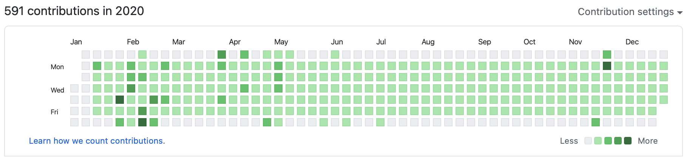

2020년 한 해가 끝났다.

올해는 그야말로 코로나로 전세계로 들썩인 한 해였다. 19년 말-20년 초 연휴에 한국에 귀국했을 때만 해도 코로나에 대해 크게 못 느꼈는데, 이젠 어디서나 마스크를 착용해야 되니 생활상이 완전히 달라졌다.

  

20년 한 해는 나에게 역시 많은 변화가 있었다. 그동안 일어난 변화 몇 가지를 적어보려고 한다.

  

## 평일 1일 1커밋

나는 무엇을 하는 것보다 안 하는 것을 더 좋아하는 타입이다. 하지만 흥미가 생기면 곧장 뛰어들어 맛을 보고 흥미를 잃어 내버려두곤 했다. 이러다 보니 1년 365일 가운데 공부를 꾸준히 하는 날이 별로 안 됐다.

  

여느 때와 같이 커뮤니티에서 시간을 낭비하던 때, 1일 1커밋을 하고 있는 사람들을 보았다. 1일 1커밋을 하면 그래도 동기부여가 되지 않을까 싶었다. '티클 모아 태산'인데 공부 내용을 하나라도 커밋하면 공부 총량이 변화할 것이라 믿었다.

  

그래서 20년 1월부터 시작하였고 정말 많은 도움이 되었다. 다만 주말엔 좀 여유를 주고 내가 하고 싶은 공부도 할 수 있게 평일만 운용하고 있다.

  

앞으로도 하루에 하나씩 꾸준히 늘려나가보도록 해야겠다.

  

### 20년에 공부한 깃 레포지터리 목록

-   [study-spring-boot-01](https://github.com/han-jinkyu/study-spring-boot-01)
-   [study-spring-boot-02](https://github.com/han-jinkyu/study-spring-boot-02)
-   [study-think-data-structures](https://github.com/han-jinkyu/study-think-data-structures)
-   [study-design-pattern](https://github.com/han-jinkyu/study-design-pattern)
-   [study-programatic-unit-testing](https://github.com/han-jinkyu/study-programatic-unit-testing)
-   [study-tobys-spring-3](https://github.com/han-jinkyu/study-tobys-spring-3)

  

## 귀국

지난 여름, 다시 시작한 2년 반 정도의 일본 생활을 정리하고 귀국했다. 귀국 후엔 집에서 공부하며 아름다운 백수 생활을 하고 있다. 돈이 부족한 것 빼면 마음이 정말 편할 따름이다.

  

20년은 회사에서 고평가를 받은 해였다. 서버 리더라는 직책이 부여되어, 회의에 자주 불려다니고 맡은 일에 눈코 뜰새 없이 바쁘기도 했다. 많이 바쁘긴 했지만 월급도 많이 상승해서 다닐만 했다. 하지만 그런 직책이 부여되고서야 내가 해볼 수 있는 경험이 늘어났다는 것은 참 아쉬웠다.

  

일본하고는 참 연이 깊다. 초등학교 때 호기심에 시작한 일본어였는데, 어쩌다 보니 이과생 하다 말고 일어일문과로 진학했고, 어쩌다 보니 일본에서 프로그래머로 취직하게 되었다. 아마 오랜 기간 일본에서 지내다 보니 한국에 정착하고 싶었는지도 모르겠다. 코로나에 대한 불안감도 그렇고 집 계약도 끝나갈 때 맞춰 귀국하게 되었다.

  

한국에 있으면 참 마음이 평온해진다. 아마 이젠 외국에서 살 지 않을 듯 싶다.

  

---

  

2020년 한 해도 잘 마무리되고 2021년 새해가 밝았다.

  

올해도 더 나은 내가 되기 위해 노력하고자 커뮤니티질은 줄이고 책을 더 보기로 했다.

  

1년 뒤에 더 좋은 내가 되어 정리글을 쓸 수 있기를 바란다.
